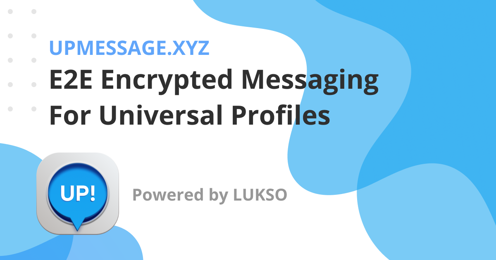

# UPMessage

| Name | Description |
| ---- | ----------- |
| Project | UPMessage |
| Description | A chat message app for Universal Profiles on LUKSO with full end-to-end encryption. |
| Team | Jake Prins, Volodymyr Lykhonis |
| Contact | info@universal.page |
| App | [upmessage.xyz](https://upmessage.xyz) |
| Source | https://github.com/Universal-Page/chat |
| Demo | [Walkthrough video](https://youtu.be/0umI16BH4L0) |

UPMessage provides Universal Profiles on LUKSO with a secure and private communication platform through a chat interface. All messages exchanged are encrypted using end-to-end encryption, ensuring that only the sender and receiver can read them. 

Users must first create a Universal Profile and sign in to use the app. Once signed in, users can search for other UPs on LUKSO and initiate a chat with them. The app utilizes the Signal-inspired protocol for end-to-end encryption, which is widely used and trusted.

Additionally, the app features robust authentication mechanisms to ensure that only authorized users can access it. It is designed for LUKSO users who prioritize privacy and security in their communication. 

On-chain interactions will be integrated into the chat interface with additional features added gradually. 
